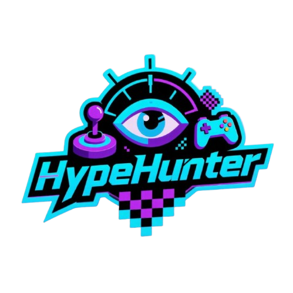
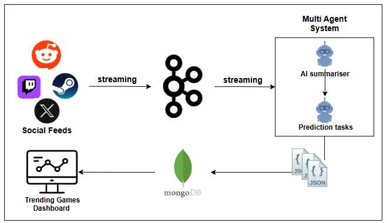
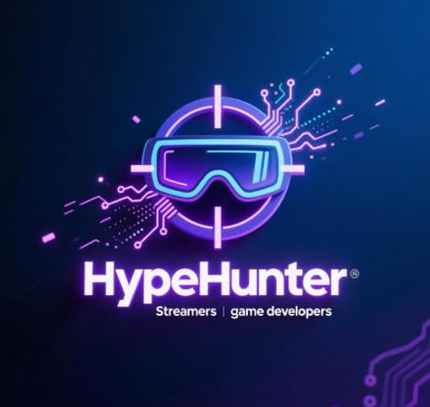

# HypeHunter: Real-Time Esports Analytics & Trend Prediction  

<p align="center">
  
</p>

**Motto:** *"Catch the Trends, Grow Your Audience"*  

HypeHunter is a cutting-edge, subscription-based analytics platform that empowers streamers, game developers, and marketing agencies with real-time insights into the gaming landscape. We transform the chaotic firehose of social media and community discussions into structured, predictive data, helping you discover the next big thing before it goes viral.  

---
## LIVE DEMO:
URL: https://www.canva.com/design/DAGy8jRaY3c/nxivgw3UMGnrJPOOjYlc4w/watch?utm_content=DAGy8jRaY3c&utm_campaign=designshare&utm_medium=link2&utm_source=uniquelinks&utlId=h74df25eef2


## Table of Contents
- [Features](#-features)  
- [High-Level Architecture](#-high-level-architecture)  
- [Tech Stack](#️-tech-stack)
- [How HypeHunter Works](#-How-HypeHunter-Works)   
- [Project Structure](#-project-structure)  
- [Installation & Setup](#️-installation--setup)  
- [Usage](#-usage)  
- [API Endpoints](#-api-endpoints)  
- [Non-Functional Requirements (NFRs)](#-non-functional-requirements-nfrs)
- [License](#-license)  
- [Contact](#-contact)  

---

## HypeHunter Features 

## Features
### 1. Predict Future Trends
Get data-driven insights into which games are likely to trend next. Stay ahead of the curve and discover upcoming hits before everyone else.

### 2. Objective Community Review Scores
See unbiased "HypeScores" based on real player discussions, not just critic reviews. Make decisions based on authentic community feedback.

### 3. Real-Time Community Insights
Instantly understand what people are thinking and how they are behaving towards games online. Monitor trends and gauge community sentiment in real time.

---

## 🏢 High-Level Architecture
HypeHunter is built on a robust, event-driven architecture designed for scalability and real-time data processing.  

**Data Flow:**  
1. **Ingestion:** PRAW agents pull external data → Kafka topics.  
2. **Stream Processing:** Clean & detect language → Kafka.  
3. **AI Analysis:** LangChain + Google Generative AI summarize & score sentiment.  
4. **Scoring & Storage:** Proprietary HypeScore → MongoDB persistence.  
5. **Client Delivery:** FastAPI serves REST & WebSocket → React frontend.  


---

## 🛠️ Tech Stack
| Layer            | Technology |
|------------------|------------|
| **Data Ingestion** | praw, requests, aiohttp, faust |
| **Message Broker** | confluent-kafka / kafka-python, Apache Kafka |
| **AI & Processing** | google-generativeai, langchain, langchain-google-genai, langchain-core, langdetect |
| **Backend (API)** | fastapi, uvicorn[standard], pydantic, python-multipart, websockets |
| **Database** | pymongo, MongoDB |
| **Frontend** | React, WebSocket Client |
| **Deployment** | Docker, Kubernetes, dotenv |

## How HypeHunter Works

HypeHunter leverages advanced data aggregation and AI-driven analytics to identify trending games and deliver actionable insights to gamers, streamers, and developers. The system’s workflow is structured as follows:

1. Data Collection

We systematically gather raw data from multiple trusted sources via APIs:

RAWG API – Provides detailed game metadata.

Twitter API – Captures social media buzz and trending discussions.

Reddit API – Monitors subreddit posts and comments in relevant gaming communities.

Twitch API – Collects live viewer statistics for streaming content.

Steam API – Retrieves player metrics, achievements, and game statistics.

This multi-source approach ensures comprehensive coverage of gaming trends across platforms.

2. Trending Game Identification

A dedicated intelligent agent scans subreddit activity, analyzing posts and comments to generate a preliminary list of potentially trending games. This candidate list is the foundation for deeper evaluation.

3. Data Aggregation

The candidate games are then queried across all APIs to collect relevant structured and unstructured data, including social engagement metrics, user statistics, and gameplay information.

4. Information Processing

Collected data is processed using our proprietary large language model, Gemnai Flash 2.0, which standardizes raw input into structured JSON objects. Each object contains detailed, multi-dimensional information about the game, including gameplay metrics, social engagement, and critical reception.

5. Rating System

A secondary LLM evaluates each game against a comprehensive multi-factor scoring framework:

Metric	Thresholds	Score
Rating	≥ 4	5
	2 < rating ≤ 4	3
	≤ 2	1
Playtime (hours)	≥ 100	5
	50 < playtime ≤ 100	3
	≤ 50	1
YouTube Views	≥ 1M	5
	100K < views ≤ 1M	3
	≤ 100K	1
Twitch Viewer Count	≥ 1000	5
	100 < viewers ≤ 999	3
	≤ 100	1
Metacritic Score	≥ 80	5
	60 < score ≤ 80	3
	≤ 60	1

This scoring system ensures that each game is evaluated holistically across popularity, engagement, and critical reception.

6. Database Storage

The processed JSON data, along with calculated ratings, are stored in a MongoDB database. This enables the frontend to dynamically fetch trending game information, ensuring users receive real-time, data-driven insights.

---



## 📦 Project Structure
```text
hypehunter/
├── backend/                 # FastAPI Application
│   ├── agents/             # Kafka Faust Agents (Ingestion, AI, Scoring)
│   ├── api/                # FastAPI routers and endpoints
│   ├── core/               # Config, security, database models
│   ├── models/             # MongoDB data models
│   ├── services/           # Business logic
│   └── main.py             # FastAPI entry point
├── frontend/               # React Application
│   ├── public/
│   ├── src/
│   │   ├── components/
│   │   ├── pages/
│   │   ├── hooks/
│   │   ├── services/
│   │   └── styles/
│   ├── package.json
│   └── Dockerfile
├── infrastructure/         # Docker, Kubernetes, Terraform
├── scripts/                # Utility scripts
├── .env.example            # Environment variables template
└── README.md

```
## ⚙️ Installation & Setup

### Prerequisites
- Python **3.10+**
- Node.js **16+**
- Docker & Docker Compose
- MongoDB Atlas URI
- Google Gemini API Key
- Reddit API Credentials

---

### 1. Clone the Repository
```bash
git clone https://github.com/your-username/hypehunter.git
cd hypehunter

## 2. Backend Setup

```bash
# Navigate to backend directory
cd backend

# Create and activate a virtual environment
python -m venv venv
# On macOS/Linux
source venv/bin/activate
# On Windows
# .\venv\Scripts\activate

# Install Python dependencies
pip install -r requirements.txt

# Copy and configure environment variables
cp .env.example .env
```

### Run Kafka locally (if not using Confluent Cloud)
```bash
docker-compose -f ../infrastructure/kafka-compose.yml up -d
```

### Start Backend Server
```bash
uvicorn main:app --reload --host 0.0.0.0 --port 8000
```


### 3. Frontend Setup
```bash
cd ../frontend
npm install

# Copy and configure API URL
cp .env.example .env.local
npm start
```

## 🚦 Usage

- **Landing Page:** Learn about features & pricing.  
- **Sign Up/In:** Create an account and choose a subscription plan.  
- **Dashboard:** View real-time trending games.  
- **Game Detail:** See AI-generated community summaries and the daily *HypeScore*.  
- **Live Updates:** Dashboard auto-refreshes via WebSocket for real-time data.


## 🧭 Frontend Routes

The application uses **React Router** to handle navigation between pages.

| Route | Component | Description |
|-------|-----------|-------------|
| `/` | `LandingPage` | Default landing page showing features & pricing. |
| `/auth` | `AuthPage` | User authentication page for sign up / login. |
| `/feed` | `FeedPage` | Main dashboard showing trending games. |
| `/game/:gameName` | `GameDetailPage` | Detailed view for a specific game, including AI summaries and HypeScore. |


## 📄 License

This project is **proprietary** and the intellectual property of **HypeHunter Inc.**  
See [LICENSE](LICENSE) for details.

---
